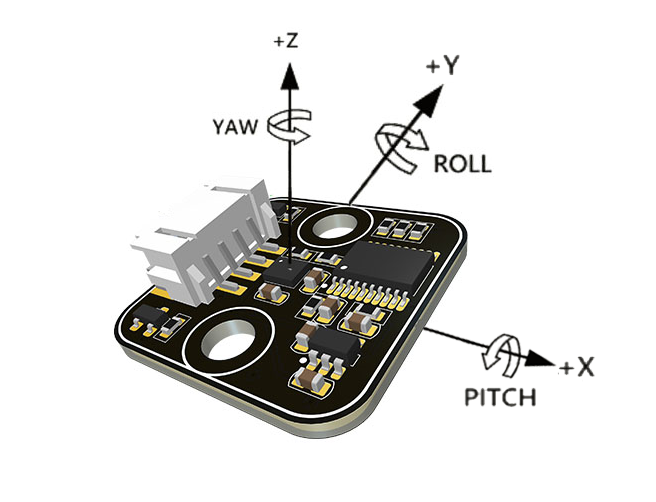

# Matrix Motion Sensor Arduino Library
Matrix Motion sensor is an Inertial Measurement Unit 9-Degree Of Freedom sensor, 
communicate by I2C interface.
## Features
Support Euler angle data. 
Gyro data, accel data. 
Internal filter select. 
Temperature monitor.
## Repository Contents
* [**/docs**](./docs) - MATRIX Motion Sensor documentation.
* [**/examples**](./examples) - Example sketches for the library (.ino). Run these from the Arduino IDE.
* [**/src**](./src) - Source files for the library (.cpp, .h).

## Documentation
[Function Description](https://matrix-robotics.github.io/MatrixMotionSensor/)  
[MATRIX Official Website](https://matrixrobotics.com/)

## License
MIT

## Orientation of Axis

